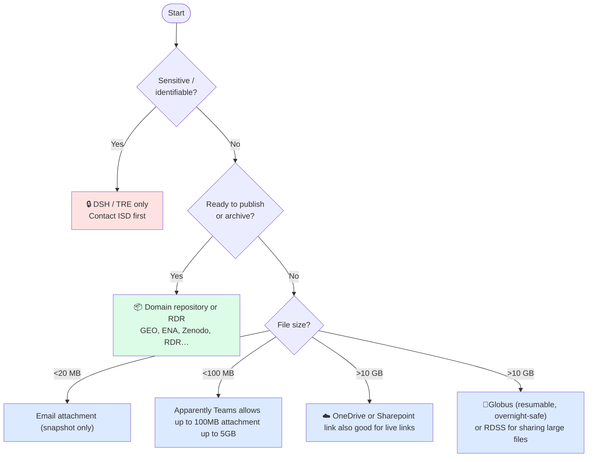

# Data Sharing & Transfer Guide — UCL Biosciences
**Note.** This is a work-in-progress — some details may need updating/amending.

> **Who is this for?** PIs, postdocs, PhD students, and professional services staff who need to share research data with collaborators, transfer large files, or make data publicly available.  
> A separate guide covers storage options (RDSS, RDR, OneDrive, etc.) and HPC-specific storage.

---

## Before you share: two questions

**1. Live or one-off?**

| You want to… | Approach |
|---|---|
| Give a collaborator ongoing access to a folder that stays in sync | Share access to RDSS |
| Send a snapshot of files as they are now | Export/download and share a static file or archive (zip/tar) |
| Make data permanently citable and public | Deposit to RDR or a domain repository — files are frozen at deposit. A DOI can be generated and point to a specific version of the data |

**2. How sensitive is the data?**

If data contains anything identifiable — patient records, linked administrative data, personal information — stop and contact ISD or ARC before doing anything else. The DSH/TRE is the only appropriate route. Do not use RDSS, OneDrive, Globus, or any link-sharing method for this data.

For all other data, continue below.

---

## Quick decision guide

> ⚠️ **Never use personal email, WeTransfer, or USB drives for research data.** These bypass UCL data governance and may breach funder or ethics requirements.

---

## Sharing options at a glance

All options below share **live files** — recipients always see the current state, not a snapshot — except RDR and domain repositories, where deposits are **frozen at upload** and cannot be updated.

| Method | Best for | Practical size limit | External | VPN required | Live files |
|---|---|---|---|---|---|
| **RDSS — direct access** | Ongoing collaboration | TB scale | Yes (PI grants) | To manage via storageadmin; not for recipient | Yes |
| **RDSS — shared link** | One-off access to specific files | TB scale | Yes | No | Yes |
| **Globus** | Large/bulk transfers, HPC-to-HPC | Effectively unlimited | Yes | No | Yes |

---

## Permissions

### Who can do what

| Action | Who |
|---|---|
| Add/remove members, admins and external collaborator on RDSS  | PI or admin, via [storageadmin.rd.ucl.ac.uk](https://storageadmin.rd.ucl.ac.uk) (UCL network or VPN required) |
| Request a Globus endpoint | Any UCL user via [rc-support@ucl.ac.uk](mailto:rc-support@ucl.ac.uk) |

### RDSS folder permissions

Permissions can be scoped per folder: read, read/write, or read/write/execute. Use this to give collaborators access only to what they need — for example, a `data/shared/` subdirectory rather than the whole project root. Managed via [storageadmin](https://storageadmin.rd.ucl.ac.uk/) (UCL network or VPN required).

### Guest / external account setup

External collaborators need either a UCL guest account or an institutional account UCL's systems recognise. For RDSS access:

- [Current process](https://www.ucl.ac.uk/advanced-research-computing/how-access-rdss-external-collaborator) says you need a UCL Visitor account and a "UCL RDSS project" email with project details.
- Plan ahead: don't leave this until a collaborator is already waiting for data
- For Globus, external collaborators use their own institutional credentials — no UCL account needed (This needs verifying)

## Practical transfer considerations

### File size

File size affects which method is practical rather than which is permitted. For small files, email attachments or OneDrive links are fine. As files get larger — multi-GB datasets, image stacks, sequencing outputs — browser-based uploads become unreliable and slow, and a dropped connection means starting again. At this scale RDSS links are more robust, and for anything in the tens of gigabytes or above, Globus is strongly preferable: it handles interruptions, can be left to run overnight, and verifies integrity automatically. There is no hard upper limit on Globus transfers, but very large transfers (hundreds of GB or more) are worth discussing with ARC (researchdata-support@ucl.ac.uk) beforehand.

### Upload speed and reliability

Network connection makes a large difference for anything over a few GB:

- **Wired ethernet on campus** — fastest and most reliable; use this for large transfers where possible
- **Eduroam (campus Wi-Fi)** — adequate for moderate transfers but shared bandwidth; avoid peak hours (10am–3pm) for anything substantial
- **Home broadband** — upload speeds are typically 10–50 Mbps; a 100 GB transfer can take several hours. Use Globus rather than browser-based tools — it handles dropped connections and resumes automatically
- **Off-peak scheduling** — Globus transfers can be left to run without supervision; prefer this for anything over ~50 GB. Globus has internal checks on data transfer success via checksums.
- As a rough guide: 100 GB at 50 Mbps upload takes around 4–5 hours; on a 1 Gbps campus connection, around 15 minutes

### VPN

UCL's GlobalProtect VPN is required to access some systems from off-campus:

- **Required:** storageadmin portal (to manage RDSS projects and permissions)
- **Not required:** OneDrive, SharePoint, RDR, Globus transfers, RDSS shared links, TRE

If you are managing a project or setting up external access remotely, connect to VPN first. VPN setup instructions: [ucl.ac.uk/isd/services/get-connected/ucl-virtual-private-network-vpn](https://www.ucl.ac.uk/isd/services/get-connected/ucl-virtual-private-network-vpn)

### Transferring from HPC (Myriad)

Myriad scratch is not backed up and subject to limits — do not leave data there waiting to be transferred. When a job completes:

1. Move outputs to **RDSS** promptly via `rsync` or the file manager
2. For large datasets going to an external collaborator, stage on RDSS then use **Globus** to transfer
3. Scratch is temporary storage only

See the HPC guide for Myriad scratch policies and mounting RDSS on the cluster.

### Format considerations

- **Many small files** (Nanopore fast5/pod5, image stacks) transfer slowly and hit the RDSS file count limit (200,000 files/project initial limit) faster than the storage limit
- **Checksums** — verify integrity for large transfers with `md5sum` or `sha256sum` at both ends; Globus does this automatically, manual transfers do not. Short guide [here](https://github.com/jdgilbert245/Comp-Guides-and-QuickStarts/blob/main/hpc/quickstart-md5check.md).
- **Compression** — often not worthwhile for already-compressed formats (FASTQ.gz, CRAM, PNG)

---

## Further help

| Need | Contact |
|---|---|
| RDSS external access, guest accounts, project setup | [researchdata-support@ucl.ac.uk](mailto:researchdata-support@ucl.ac.uk) |
| Globus endpoint setup, HPC transfers | [researchdata-support@ucl.ac.uk](mailto:researchdata-support@ucl.ac.uk) |
| DSH / TRE access | ARC |
| VPN setup | [ISD VPN guidance](https://www.ucl.ac.uk/isd/services/get-connected/ucl-virtual-private-network-vpn) |
| HPC storage and scratch policies | See [HPC guide](https://github.com/UCL-Biosciences/Biosciences-Comp-Support/blob/main/UCL_comp_guides/high_performance_compute_at_UCL.md) |
