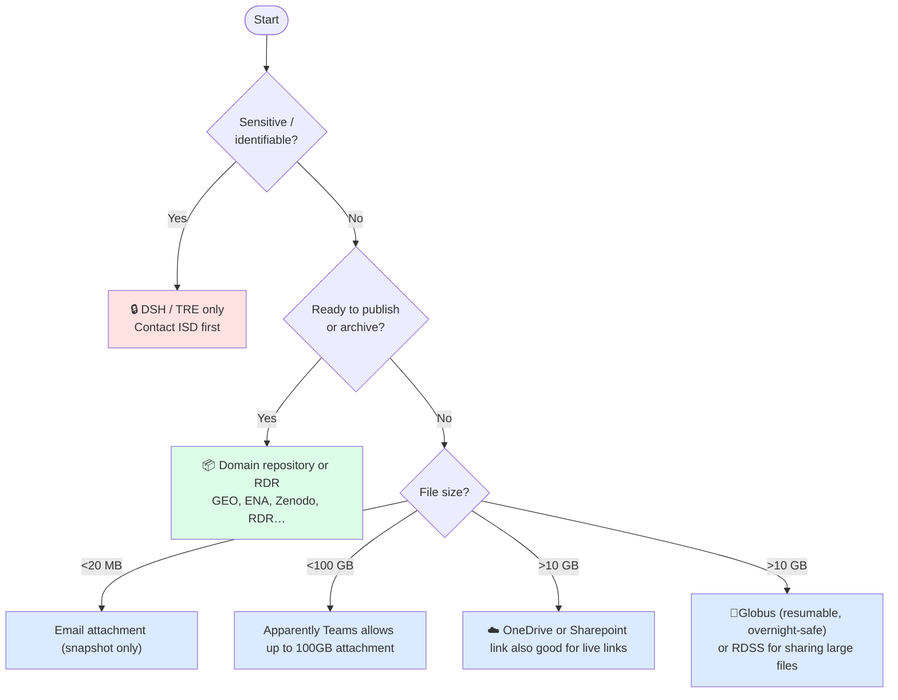

# Data Sharing & Transfer Guide — UCL Biosciences
**Note.** This is a work-in-progress — some details may need updating/amending.

> **Who is this for?** PIs, postdocs, PhD students, and professional services staff who need to share research data with collaborators, transfer large files, or make data publicly available.  
> A separate guide covers storage options (RDSS, RDR, OneDrive, etc.) and HPC-specific storage.

---

## Before you share: two questions

**1. Live or one-off?**

| You want to… | Approach |
|---|---|
| Give a collaborator ongoing access to a folder that stays in sync | Share access to RDSS or OneDrive directly — they always see current files |
| Send a snapshot of files as they are now | Export/download and share a static file or archive (zip/tar) |
| Make data permanently citable and public | Deposit to RDR or a domain repository — files are frozen at deposit |

**2. How sensitive is the data?**

If data contains anything identifiable — patient records, linked administrative data, personal information — stop and contact ISD or ARC before doing anything else. The DSH/TRE is the only appropriate route. Do not use RDSS, OneDrive, Globus, or any link-sharing method for this data.

For all other data, continue below.

---

## Quick decision guide

> ⚠️ **Never use personal email, WeTransfer, or USB drives for research data.** These bypass UCL data governance and may breach funder or ethics requirements.

---

## Sharing options at a glance

All options below share **live files** — recipients always see the current state, not a snapshot — except RDR and domain repositories, where deposits are **frozen at upload** and cannot be updated.

| Method | Best for | Practical size limit | External | VPN required | Live files |
|---|---|---|---|---|---|
| **RDSS — direct access** | Ongoing collaboration | TB scale | Yes (PI grants) | To manage via storageadmin; not for recipient | Yes |
| **RDSS — shared link** | One-off access to specific files | TB scale | Yes | No | Yes |
| **OneDrive link** | Small files, Office docs, quick shares | ~10 GB practical | Yes | No | Yes |
| **SharePoint** | Team/departmental documents | Varies | Yes | No | Yes |
| **Globus** | Large/bulk transfers, HPC-to-HPC | Effectively unlimited | Yes | No | Yes |
| **RDR** | Published / archived datasets | 50 GB default | Public (DOI) | No | **No — frozen at deposit** |
| **Domain repository** | Published data in your field | Varies | Public | No | **No — frozen at deposit** |
| **DSH / TRE** | Sensitive / identifiable data | Varies | Controlled | Inside TRE only | Yes |

---

## Permissions

### Who can do what

| Action | Who |
|---|---|
| Add/remove members, set folder permissions | PI or designated project admin |
| Grant external collaborator access to RDSS | PI or admin, via [storageadmin.rd.ucl.ac.uk](https://storageadmin.rd.ucl.ac.uk) (UCL network or VPN required) |
| Share an OneDrive or SharePoint link | Any UCL user |
| Set link expiry or restrict to view-only | Any UCL user (in the share dialog) |
| Request a Globus endpoint | Any UCL user via [rc-support@ucl.ac.uk](mailto:rc-support@ucl.ac.uk) |
| Deposit to RDR | Any UCL researcher |

### RDSS folder permissions

Permissions can be scoped per folder: read, read/write, or read/write/execute. Use this to give collaborators access only to what they need — for example, a `data/shared/` subdirectory rather than the whole project root. Managed via storageadmin (UCL network or VPN required).

### Link permissions (OneDrive / SharePoint / RDSS)

When sharing via link, always consider:

- **View-only vs edit** — use view-only unless the recipient needs to add or change files
- **Expiry date** — set one for any external share; there is no automatic expiry
- **Password protection** — available for OneDrive links; useful for anything going outside UCL
- **Specific people vs anyone with the link** — prefer specific people where possible

### Guest / external account setup

External collaborators need either a UCL guest account or an institutional account UCL's systems recognise. For RDSS access:

- [Current process](https://www.ucl.ac.uk/advanced-research-computing/how-access-rdss-external-collaborator) says you need a UCL Visitor account and a "UCL RDSS project" email with project details.
- Plan ahead: don't leave this until a collaborator is already waiting for data
- For Globus, external collaborators use their own institutional credentials — no UCL account needed (This needs verifying)

---

## Service details

### RDSS — sharing with external collaborators
**Use when:** you have an active collaboration with someone outside UCL who needs ongoing access to project data.

**Key facts:**
- External access is set up by the PI at [storageadmin.rd.ucl.ac.uk](https://storageadmin.rd.ucl.ac.uk) — **requires UCL network or VPN**
- Per-folder permissions can be scoped to read or read/write
- Projects expire after 5 years; collaborators lose access at that point without a renewal

**Gotchas:**
- 200,000-file-per-TB limit applies regardless of who is accessing — plan for genomics/imaging data
- storageadmin portal is not accessible without UCL network or VPN

---

### OneDrive
**Use when:** sharing lightweight documents, analysis outputs, or Office files quickly with internal or external colleagues.

**Key facts:**
- 1 TB+ via UCL's Microsoft 365 subscription; accessible from anywhere without VPN
- Share links can expire and require sign-in — use these controls for anything non-trivial

**Gotchas:**
- Not appropriate as primary research data storage — use RDSS for that
- OneDrive sync on large folders (many files, large datasets) is unreliable — use Globus or rsync instead

---

### Globus
**Use when:** transferring large datasets (>10 GB), moving data between HPC systems, or running a reliable ongoing data pipeline with an external institution.

**Key facts:**
- Managed, resumable, high-speed transfers — survives dropped connections and can be scheduled overnight
- UCL has an institutional Globus endpoint; contact [rc-support@ucl.ac.uk](mailto:rc-support@ucl.ac.uk) to get set up
- Myriad (HPC) can be configured as an endpoint — transfer data directly from scratch without pulling to a local machine first
- Collaborators at most research universities already have institutional endpoints; if not, they can use Globus Personal Connect on their own machine
- **No VPN required** — transfers run independently once initiated
- Transfers are authenticated and logged

**Gotchas:**
- Initial setup takes effort — not the right tool for a quick one-off small transfer
- Both sender and receiver need an endpoint; confirm with your collaborator before committing
- Myriad scratch is not backed up — don't use it as a long-term staging area

---

### RDR — UCL Research Data Repository
**Use when:** a project is ending, a paper is being submitted, or a funder requires public archiving.

**Key facts:**
- Data receives a DOI and is publicly accessible — treat it as a permanent publication
- 50 GB per-person limit by default; contact [researchdata-support@ucl.ac.uk](mailto:researchdata-support@ucl.ac.uk) to increase
- Discipline-specific repositories (GEO, ENA, Zenodo, etc.) are preferable where they exist
- Embargo periods available if data must be withheld until publication

**Gotchas:**
- Once public, data cannot easily be unpublished — confirm ethics/consent approval before uploading
- Not appropriate for sharing data with active collaborators — use RDSS for that

---

### DSH / TRE
**Use when:** data contains sensitive or identifiable information — patient records, linked administrative data, anything with ethical controls on access.

Contact ISD or ARC before starting. Setup takes weeks — factor this into project timelines from the outset. Do not store or share sensitive data via any other route, even temporarily.

---

## Practical transfer considerations

### File size

| Size | Recommended method |
|---|---|
| < 1 GB | OneDrive link, RDSS link |
| 1–10 GB | RDSS link or OneDrive (test first) |
| 10 GB – 1 TB | Globus or RDSS direct access |
| > 1 TB | Globus; discuss staging with ARC if moving to/from HPC |

### Upload speed and reliability

Network connection makes a large difference for anything over a few GB:

- **Wired ethernet on campus** — fastest and most reliable; use this for large transfers where possible
- **Eduroam (campus Wi-Fi)** — adequate for moderate transfers but shared bandwidth; avoid peak hours (10am–3pm) for anything substantial
- **Home broadband** — upload speeds are typically 10–50 Mbps; a 100 GB transfer can take several hours. Use Globus rather than browser-based tools — it handles dropped connections and resumes automatically
- **Off-peak scheduling** — Globus transfers can be left to run overnight without supervision; prefer this for anything over ~50 GB
- As a rough guide: 100 GB at 50 Mbps upload takes around 4–5 hours; on a 1 Gbps campus connection, around 15 minutes

### VPN

UCL's GlobalProtect VPN is required to access some systems from off-campus:

- **Required:** storageadmin portal (to manage RDSS projects and permissions), S Drive, some legacy UCL services
- **Not required:** OneDrive, SharePoint, RDR, Globus transfers, RDSS shared links

If you are managing a project or setting up external access remotely, connect to VPN first. VPN setup instructions: [ucl.ac.uk/isd/services/get-connected/ucl-virtual-private-network-vpn](https://www.ucl.ac.uk/isd/services/get-connected/ucl-virtual-private-network-vpn)

### Transferring from HPC (Myriad)

Myriad scratch is not backed up and is subject to purge — do not leave data there waiting to be transferred. When a job completes:

1. Move outputs to **RDSS** promptly via `rsync` or the file manager
2. For large datasets going to an external collaborator, stage on RDSS then use **Globus** to transfer
3. Do not treat scratch as a staging area for more than a day or two

See the HPC guide for Myriad scratch policies and mounting RDSS on the cluster.

### Format considerations

- **Many small files** (Nanopore fast5/pod5, image stacks) transfer slowly and hit the RDSS file count limit (200,000 files/TB) faster than the storage limit — consider archiving to `tar` first, or use consolidated formats like HDF5/zarr/OME-Zarr
- **Checksums** — verify integrity for large transfers with `md5sum` or `sha256sum` at both ends; Globus does this automatically, manual transfers do not
- **Compression** — often not worthwhile for already-compressed formats (FASTQ.gz, CRAM, PNG)

---

## Funder requirements

Most funders require a **Data Management Plan (DMP)** at application stage and open data deposition on publication. Sharing arrangements should be described in your DMP.

- **UKRI** (BBSRC, MRC, NERC, etc.): data available with minimal restrictions, usually within 12 months of publication. Zenodo and discipline-specific repos acceptable.
- **Wellcome**: specific guidance for genomics, imaging, and clinical data — check the Wellcome Data, Software & Materials policy.
- **Horizon Europe**: open data by default; DMPs required.

UCL's [Research Data Support team](mailto:researchdata-support@ucl.ac.uk) can advise on DMPs and identify the right repository. The [DMP Online tool](https://dmponline.dcc.ac.uk/) has funder-specific templates.

---

## Further help

| Need | Contact |
|---|---|
| RDSS external access, guest accounts, project setup | [researchdata-support@ucl.ac.uk](mailto:researchdata-support@ucl.ac.uk) |
| Globus endpoint setup, HPC transfers | [rc-support@ucl.ac.uk](mailto:rc-support@ucl.ac.uk) |
| DSH / TRE access | ISD / ARC |
| DMP advice, RDR deposits | [researchdata-support@ucl.ac.uk](mailto:researchdata-support@ucl.ac.uk) |
| VPN setup | [ISD VPN guidance](https://www.ucl.ac.uk/isd/services/get-connected/ucl-virtual-private-network-vpn) |
| HPC storage and scratch policies | See HPC guide *(coming soon)* |
