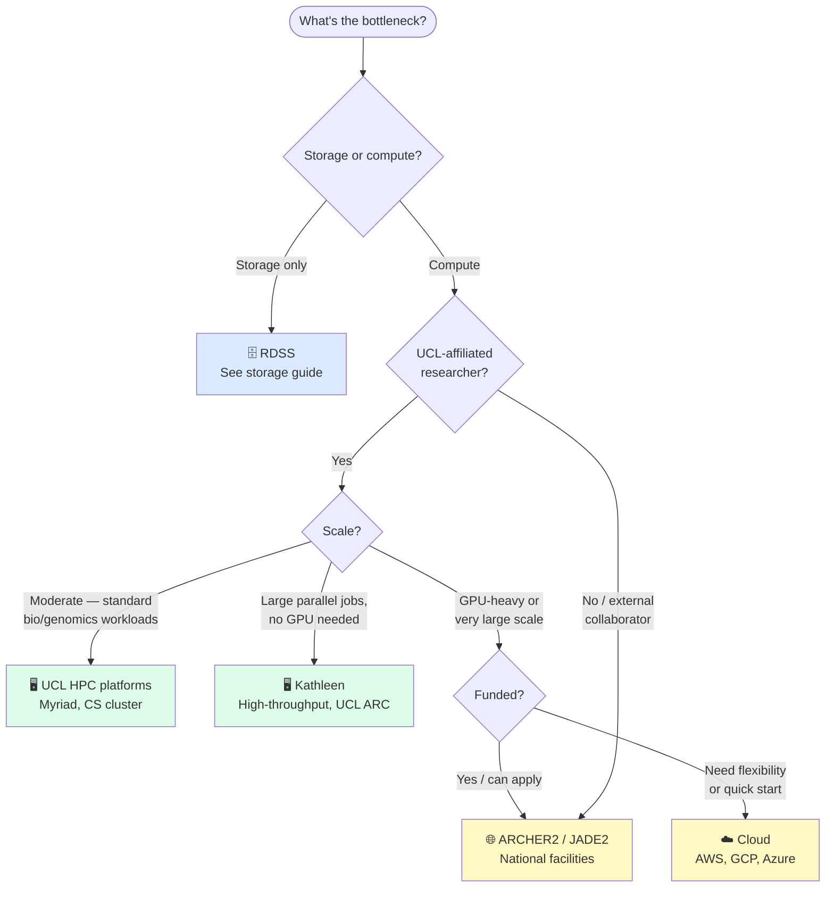

# HPC & Cloud Computing Guide — UCL Biosciences

**Note:** This is a work-in-progress — some details may need updating/amending.

> **Who is this for?** Researchers whose data are too large to store locally, or whose analyses are too slow or memory-hungry to run on a laptop. This guide orients you to the available options and signposts further resources.

---

## Is HPC what you need?

HPC is not always the answer. Before requesting access, it's worth being clear on the problem:

| Problem | Likely solution |
|---|---|
| Files too large to store on laptop | RDSS (see [storage guide](/Biosciences-Comp-Support/guides/storage/)) — you may not need HPC at all |
| Analysis too slow on laptop | HPC compute — see the UCL platforms below |
| Analysis needs more RAM than laptop has | HPC compute — check memory requirements before submitting |
| Analysis needs a GPU | Check availability on UCL platforms, or cloud |
| Need to run hundreds of jobs in parallel | HPC — this is where it excels |
| Collaborators outside UCL need same environment | Cloud or national facilities may be more practical |

---

## Which system?



---

## UCL systems at a glance

UCL has two main HPC platforms available to Biosciences researchers: systems managed by [Advanced Research Computing (ARC)](https://www.rc.ucl.ac.uk/) and the [CS HPC cluster](https://hpc.cs.ucl.ac.uk/).

| System | Best for | Scheduler | Free to use | GPU | More info |
|---|---|---|---|---|---|
| **Myriad** | General research computing, most biosciences workloads | SGE | Yes (UCL staff/students) | Yes but queuing times can be long in busy periods | [rc.ucl.ac.uk/docs/Clusters/Myriad](https://www.rc.ucl.ac.uk/docs/Clusters/Myriad/) |
| **Kathleen** | High-throughput parallel jobs, large core counts | SGE | Yes (UCL staff/students) | No | [rc.ucl.ac.uk/docs/Clusters/Kathleen](https://www.rc.ucl.ac.uk/docs/Clusters/Kathleen/) |
| **CS HPC cluster** | *[Details to be added]* | *TBC* | *TBC* | *TBC* | [hpc.cs.ucl.ac.uk](https://hpc.cs.ucl.ac.uk/) |

---

## Getting access

**Myriad and Kathleen** — request an account via the [ARC self-service portal](https://www.rc.ucl.ac.uk/docs/Account_Services/). You will need a UCL userid. Access is usually granted within a few weeks.

**CS HPC cluster** — see [hpc.cs.ucl.ac.uk](https://hpc.cs.ucl.ac.uk/) for access procedures. *[Further details to be added.]*

**National facilities (ARCHER2, JADE2, etc.)** — access is via UKRI allocation. Your PI needs to apply through [SAFE](https://safe.epcc.ed.ac.uk/) or the relevant facility portal. Allocations are granted competitively; plan ahead.

**Cloud (AWS, GCP, Azure)** — UCL has framework agreements that may offer discounted or credited access. Contact your faculty research support team to find out what's available. For small-scale or exploratory work, free tiers often suffice.

---

## Submitting jobs

### Login nodes vs compute nodes

When you SSH into an HPC system, you land on a **login node** — a shared machine used by everyone for setting up, editing scripts, moving files, and submitting jobs. It is not for running analyses.

{: .warning }
> **Do not run analyses on login nodes.** They are shared resources. Running jobs there will affect all other users.

**Compute nodes** are where your analysis actually runs. You never access them directly — instead you describe what resources you need (cores, memory, time) in a job script, submit it to the queue, and the scheduler allocates nodes when they become available.

### GPUs

GPUs are available on Myriad. To submit a job requesting GPUs, see [the ARC GPU job script example](https://www.rc.ucl.ac.uk/docs/Example_Jobscripts/#gpu-job-script-example).

{: .info }
> GPU queues on Myriad can have long wait times during busy periods. Plan accordingly or consider JADE2 / cloud for GPU-heavy work.

### The basic workflow

Myriad and Kathleen use **SGE (Sun Grid Engine)**. The CS cluster scheduler details are available at [hpc.cs.ucl.ac.uk](https://hpc.cs.ucl.ac.uk/). If you have used SLURM elsewhere, the concepts are transferable.

1. SSH to the login node
2. Stage your data (copy from RDSS or transfer via Globus — see the [data sharing guide](/Biosciences-Comp-Support/guides/data-sharing/))
3. Write a job script specifying resources (cores, memory, wall time)
4. Submit with `qsub`
5. Monitor with `qstat`
6. Retrieve outputs and move off scratch promptly

#### A minimal SGE job script

```bash
#!/bin/bash -l
#$ -l h_rt=2:00:00        # wall time
#$ -l mem=8G              # RAM per core
#$ -pe smp 4              # number of cores
#$ -cwd                   # run from current directory
#$ -o logs/job.out
#$ -e logs/job.err

module load <your_software>
your_command --input data/ --output results/
```

Full ARC documentation including array jobs, GPU requests, and interactive sessions: [rc.ucl.ac.uk/docs/](https://www.rc.ucl.ac.uk/docs/)

{: .highlight }
> **If you are new to HPC**, ARC run regular introductory training — see the [ARC training pages](https://www.ucl.ac.uk/advanced-research-computing/education/training) before trying to figure things out alone.

---

## Storage on HPC

HPC storage is **not** the same as research data storage — see the [storage guide](/Biosciences-Comp-Support/guides/storage/) for RDSS, RDR, and related services. The table below refers to Myriad/Kathleen; CS cluster storage is described at [hpc.cs.ucl.ac.uk](https://hpc.cs.ucl.ac.uk/).

{: .warning }
> ⚠️ **The backup and purge details in this table need verifying against current Myriad policy — treat with caution until confirmed.**

| Location | Purpose | Backed up | Purged |
|---|---|---|---|
| `$HOME` | Scripts, config, small files | Yes | No |
| `$SCRATCH` (`/scratch/`) | Job input/output during runs | **No** | **Yes — check current policy** |
| `$TMPDIR` | Temporary files within a single job | **No** | On job end |
| RDSS (mounted) | Long-term research data | Yes | No |

{: .danger }
> **The most common mistake** is leaving outputs on scratch after a job finishes. Scratch is subject to purge — data may be deleted without warning. Move results to RDSS as soon as a job completes.

### Myriad ↔ RDSS

RDSS can be accessed directly from Myriad. See the ISD guide for current setup instructions: [ucl.ac.uk/isd/how-to/rdss-myriad-data-storage-transfer-service](https://www.ucl.ac.uk/isd/how-to/rdss-myriad-data-storage-transfer-service)

### Moving data to/from HPC

- **Small files**: `scp` or `rsync` over SSH to the login node
- **Large files**: use Globus (see [data sharing guide](/Biosciences-Comp-Support/guides/data-sharing/)) — more reliable than rsync for large transfers and can be left unattended
- **From RDSS to scratch before a job**: use `rsync` from the login node once RDSS is mounted

---

## Software, modules, and containers

The following applies to Myriad and Kathleen. CS cluster software environment details are available at [hpc.cs.ucl.ac.uk](https://hpc.cs.ucl.ac.uk/).

### Environment modules

Rather than installing software yourself, HPC systems provide a large library of pre-installed, optimised packages via the `module` system. This means you don't need to download or build tools yourself.

```bash
module avail            # list all available software
module load <name>      # load a package into your environment
module list             # see what's currently loaded
module unload <name>    # remove a package
```

If software you need is not available on Myriad/Kathleen, request it via [rc-support@ucl.ac.uk](mailto:rc-support@ucl.ac.uk), or install it yourself using conda (see below).

### Conda

For Python and R packages not in the module system, conda environments work well on HPC. Load the UCL-provided miniconda module rather than installing conda yourself:

```bash
module load python/miniconda3/4.10.3
source $UCL_CONDA_PATH/etc/profile.d/conda.sh

conda create -n myenv python=3.11
conda activate myenv
conda install <packages>
```

Build and test your environment on the login node, then activate it in your job script using the same two `module load` / `source` lines before calling your commands.

### Containers (Apptainer / Singularity)

Myriad supports **Apptainer** (formerly Singularity) for containerised workflows. This is useful when you need a specific software stack, are running a pipeline with a published container image (e.g. Nextflow pipelines), or need reproducibility.

```bash
apptainer pull docker://myimage:tag
apptainer exec myimage.sif mycommand
```

---

## When HPC isn't the answer

HPC has a learning curve and is not always the most efficient route. Consider alternatives when:

- **Your analysis is interactive** — HPC batch queues mean waiting; for exploratory work a cloud VM or UCL's virtual desktop may be faster to iterate on
- **You need specialist infrastructure** — clinical data requires the DSH/TRE; some deep learning workloads are better served by JADE2 or cloud GPU instances
- **Your collaborators need access** — national facilities or cloud are often easier to share with external partners than UCL HPC
- **You need to scale quickly** — cloud can provision resources in minutes; HPC allocations take time

---

## Further help

| Need | Contact / resource |
|---|---|
| Myriad / Kathleen account, job issues | [rc-support@ucl.ac.uk](mailto:rc-support@ucl.ac.uk) |
| ARC documentation | [rc.ucl.ac.uk/docs](https://www.rc.ucl.ac.uk/docs/) |
| ARC training | [ucl.ac.uk/advanced-research-computing/education/training](https://www.ucl.ac.uk/advanced-research-computing/education/training) |
| CS HPC cluster | [hpc.cs.ucl.ac.uk](https://hpc.cs.ucl.ac.uk/) |
| Myriad ↔ RDSS setup | [ucl.ac.uk/isd/how-to/rdss-myriad-data-storage-transfer-service](https://www.ucl.ac.uk/isd/how-to/rdss-myriad-data-storage-transfer-service) |
| RDSS general, data movement | [researchdata-support@ucl.ac.uk](mailto:researchdata-support@ucl.ac.uk) |
| National facility applications | [rc-support@ucl.ac.uk](mailto:rc-support@ucl.ac.uk) |
| Cloud access / UCL agreements | Contact ARC or faculty research support |
