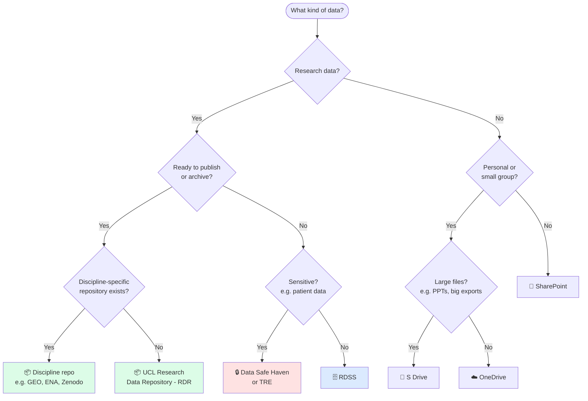

# Data Storage Guide — UCL Biosciences

**Note:** This is a work-in-progress — some details may need updating/amending.

> **Who is this for?** PIs, postdocs, and PhD students who need to store, share, or archive research data at UCL.
> 
> A separate guide covers [HPC-specific storage](/Biosciences-Comp-Support/guides/hpc/) (Myriad scratch, Lustre, etc.).

---

## Quick decision guide

{: .warning }
> **HPC scratch (Myriad `/scratch`, `/tmpdir`)** is not storage — always move outputs to RDSS or your local machine promptly. See the [HPC guide](/Biosciences-Comp-Support/guides/hpc/) for details.

---

## Storage options at a glance

| Service | For | Size | Cost | Backed up | External sharing |
|---|---|---|---|---|---|
| **RDSS** | Unpublished research data | 1TB free, expandable | Free at point of use, ~£50/TB/yr should be charged to grants where possible | Yes | Yes (recently added) |
| **RDR** | Published / archived datasets | 50GB/person (increasable) | Free | Yes (long-term) | Public (DOI issued) |
| **DSH / TRE** | Sensitive/identifiable data | Varies | Contact ISD | Yes | Restricted |
| **S Drive** | Team working files, large non-research | 200GB+ | Free up to limit; £0.15/GB/3yr beyond | Yes (hourly) | UCL only |
| **OneDrive** | Light personal/collaborative docs | 1TB+ | Free (UCL subscription) | Yes | Yes |
| **SharePoint** | Departmental/team/wider UCL content | Varies | Free | Yes | Yes |
| **HPC scratch** | Temporary compute I/O only | Large but shared | Free | **No** | No |

---

## Service details

### RDSS — Research Data Storage Service

**Use when:** you have active, unpublished research data that needs to be shared within a project team.

**Key facts:**

- Projects are created by the **PI** at [storageadmin.rd.ucl.ac.uk](https://storageadmin.rd.ucl.ac.uk/projects/new) (UCL network required); generally processed within a few days
- Staff and students can be admins/members — good for large collaborative projects
- 1TB free; request more through the same portal (cost to grant where possible)
- **File limit:** 200,000 files per TB — for large genomics/imaging projects this bites faster than the storage limit; plan accordingly
- **Project max duration:** 5 years from registration date; PI gets email warning before expiry
- Storage usage visible at [storageadmin.rd.ucl.ac.uk](https://storageadmin.rd.ucl.ac.uk) — updated overnight, not live
- External collaborators can now be granted direct access
- Per-folder permissions can be set (read/write/execute) — useful for giving team members private subdirectories

**Gotchas:**

- You must be on the UCL network (or VPN) to create or manage a project
- The 5-year cap means long-running projects need a migration plan — don't leave this to the last minute
- Large numbers of small files (e.g. Nanopore fast5/pod5, image stacks) will hit the file count limit before the storage limit; consider archiving to tar or using a format like zarr/HDF5

**Tips:**

- Structure your project directory from day one — it's painful to reorganise later when the project has 10 members
- Set up a `scratch/` or `tmp/` subdirectory for intermediate files so the important stuff is easy to find
- PhD students: make sure your PI has set up the RDSS project before you start generating data

---

### RDR — UCL Research Data Repository

**Use when:** a project is ending, a paper is being submitted, or a funder requires data archiving.

**Key facts:**

- Data is **publicly accessible** and assigned a DOI — treat it as permanent publication
- 50GB per-person upload limit by default; contact [researchdata-support@ucl.ac.uk](mailto:researchdata-support@ucl.ac.uk) to increase
- Discipline-specific repositories (GEO, ENA, ArrayExpress, Zenodo, etc.) should be considered first where they exist — they're more discoverable by your community

**Gotchas:**

- Once data is deposited and public, you cannot easily unpublish it — make sure you have consent/ethics approval to share before uploading
- The 50GB default limit is low for genomics or imaging; request an increase early, not the day before submission

**Tips:**

- Check your funder's preferred repository before depositing (UKRI often accepts Zenodo; Wellcome prefers specific repos for certain data types)
- Deposit raw data, not just processed outputs — reviewers and future researchers will thank you

---

### DSH / TRE — Data Safe Haven & Trusted Research Environment

**Use when:** data contains sensitive or identifiable information, e.g. NHS patient records, linked administrative data, or anything requiring ethical controls on access.

**Key facts:**

- DSH is the current service; ARC is building a new TRE with more compute flexibility
- Access and egress are controlled and audited
- Contact ISD or ARC to discuss your project before starting — setup takes time

{: .danger }
> **Do not store sensitive data on RDSS, OneDrive, or S Drive, even temporarily.** Use DSH/TRE only.

---

### S Drive

**Use when:** a team needs a shared working space for non-research files (admin, presentations, meeting notes, etc.).

- 200GB+ for staff; additional space purchasable at £0.15/GB for 3 years
- Hourly backups
- Not designed for large research data volumes — use RDSS for that

---

### OneDrive

**Use when:** you need to sync and share lightweight documents across devices, or collaborate on Office files with internal or external colleagues.

- 1TB per user via UCL's Microsoft 365 subscription
- Easy external sharing, works across devices
- Not appropriate for primary research data storage — think of it as a working/collaboration layer

---

### SharePoint

**Use when:** you're managing content for a wider team, department, or project that needs structured document management and broader access.

- Good for lab wikis, shared protocols, department resources
- Not appropriate for large or sensitive research datasets

---

## A note on funder requirements

Most major funders now require a **Data Management Plan (DMP)** at application stage and open data deposition on publication. Key points:

- **UKRI** (BBSRC, MRC, NERC, etc.): requires a DMP; data should be made available with minimal restrictions, usually within 12 months of publication. Zenodo and discipline-specific repos are acceptable.
- **Wellcome**: requires open access data deposition; has specific guidance for genomics, imaging, and clinical data types.
- **Horizon Europe**: open data by default; DMPs required.

UCL's [Research Data Support team](mailto:researchdata-support@ucl.ac.uk) can advise on DMPs and help identify the right repository. The [DMP Online tool](https://dmponline.dcc.ac.uk/) has funder templates.

---

## Further help

| Need | Contact |
|---|---|
| RDSS project setup, storage limits, file count issues | [researchdata-support@ucl.ac.uk](mailto:researchdata-support@ucl.ac.uk) |
| DSH / TRE access | ISD / ARC |
| DMP advice, RDR deposits | [researchdata-support@ucl.ac.uk](mailto:researchdata-support@ucl.ac.uk) |
| HPC storage (Myriad scratch, Lustre) | See [HPC guide](/Biosciences-Comp-Support/guides/hpc/) |
